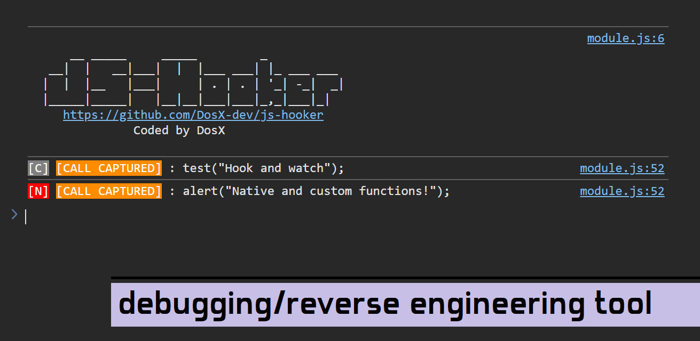

# JS-Hooker



**[js-hooker.js](https://github.com/DosX-dev/js-hooker/blob/main/include/js-hooker.js)** is a JavaScript module designed for reverse engineering and debugging. It provides a straightforward way to monitor and log external calls made within an application, helping you understand function usage and behavior.

---

**Features**

 * 🚀 **Real-Time Function Call Monitoring** — Tracks all functions of a given object (like `window`, `document`, or `localStorage`) and logs their usage, including arguments.
 * 🔍 **Native and Code Call Differentiation** — Shows if a function is native or custom (code call). Custom functions are invoked within the app's logic and marked as `[C]` in the logs.
 * ⚙️ **Customizable Scope** — Allows monitoring specific objects and excluding selected functions from hooking.
 * 📋 **Readable Console Output** — Displays logs in a clean, color-coded format for better clarity.
 * 🌐 **Flexible Environment Support** — Works smoothly in both browser and Node.js environments.

---

## Usage

1. **Load the Module**:
   Include the script in HTML file like this:
   ```html
   <script src=".../js-hooker.js"></script>
   ```
   Or, inject it using:
   - A custom browser extension
   - Developer tools console

2. **Automatic Hooking**:
   By default, the script hooks into frequently used objects like:
   - `window`
   - `navigator`
   - `localStorage`
   - `sessionStorage`
   - `document`
   - `history`

3. **Custom Hooking**:
   To manually hook specific objects or exclude certain functions:
   ```javascript
   watchAllFunctions(customObject, ["methodToExclude"]);
   ```

4. **Console Output**:
   When a hooked function is called, you'll see this in the console:
   ```
   [N] [CALL CAPTURED]: functionName(arg1, arg2, ...);
   ```
   - `[N]`: Native function call
   - `[C]`: Code call (custom function defined in the app)

## Sample Output

### Native Function Call
```plaintext
[N] [CALL CAPTURED]: localStorage.getItem("key");
```

### Code Call (Custom Function)
```plaintext
[C] [CALL CAPTURED]: customFunction("test", { "param": true });
```

## Advanced Configuration

### Exclude Functions
To avoid tracking specific functions, add their names to the exclusion list:
```javascript
watchAllFunctions(window, ["alert"]);
```

### Node.js Support
Monitor global functions in a Node.js environment:
```javascript
if (typeof global === 'object') {
    watchAllFunctions(global);
}
```

## Customization
This script is intentionally simple to modify. You can tweak its behavior, such as the logging format, which objects it tracks, or even extend its functionality to match your requirements.

## Disclaimer
This tool is for educational purposes, debugging, and lawful reverse engineering only. Ensure compliance with legal and ethical guidelines while using it.
